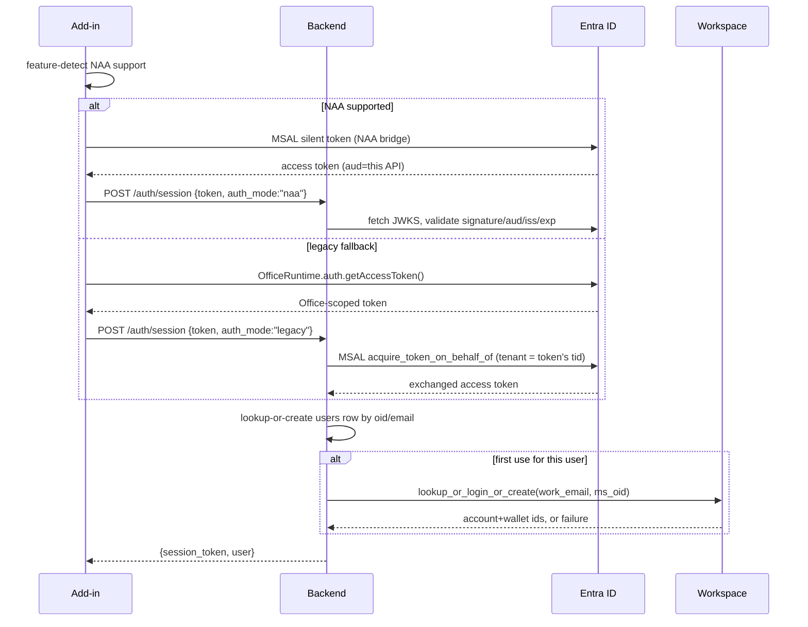
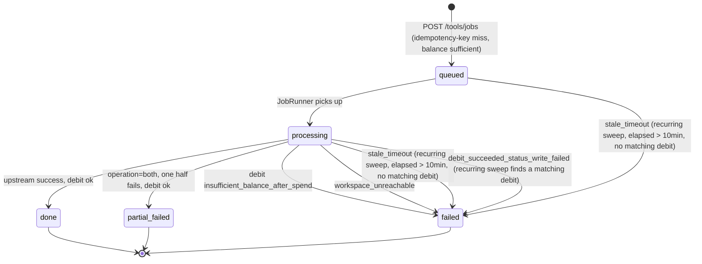
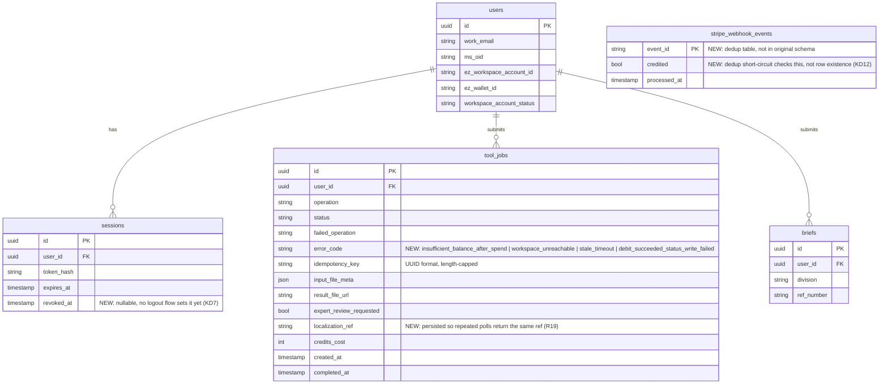

# EZ Office Add-in Backend (FastAPI) - Plan

## Goal Capsule

- **Objective:** An authenticated Office Add-in user can hold a Workspace-backed credit wallet, submit Flip/Translate/Both jobs against their active PowerPoint file, top up credits via Stripe, and submit an Intelligent Brief — all through a live backend whose request/response shapes match the frontend's already-shipped mock API layer.
- **Means:** A FastAPI + PostgreSQL service built from scratch in `backend/` per `ARCHITECTURE.md` §3-§8, extended by the decisions in this plan's Product Contract Key Decisions and Planning Contract KTDs where research found the source doc underspecified. (KD1-KD13, KTD1-KTD5)
- **Authority hierarchy:** `ARCHITECTURE.md` is the source of truth for everything it specifies; this plan's Key Decisions amend or extend it only where cited. Flip/Translate upstream contracts remain externally pending (§6) — this plan builds against the documented placeholder shape and isolates it behind `flip_client.py`/`translate_client.py`. The EZ Workspace contract is this backend's own to dictate (KD1) — build to it as authoritative, not provisional.
- **Stop conditions:** Stop and report back if research surfaces evidence that a session-settled decision (KD1-KD4, KTD1, KTD4, KD10, KD11) cannot work as specified — none was found during planning.
- **Execution profile:** Standard code execution via `ce-work`; no goal-mode automation needed.
- **Who finishes and ships:** The implementer (human or `ce-work`) lands all seven units and passes the Verification Contract; the repo owner reviews before merge — no live Entra ID or Stripe credentials exist yet (see Assumptions), so end-to-end verification against real Microsoft/Stripe sandboxes is a follow-up once those are provisioned, not a gate on this plan's completion.

---

## Product Contract

### Summary

Build the real backend for the EZ Office Add-in: dual-path Entra ID auth, a Workspace-passthrough wallet (no local ledger), Flip/Translate/Both job processing with idempotent submission and partial-failure billing, a Stripe-driven top-up flow, and the Intelligent Brief persistence endpoint — matching `ARCHITECTURE.md` §3-§8 and closing the gaps research found in that spec.

### Problem Frame

The frontend ships against an in-memory mock (`frontend/src/services/mock/`) with no live backend behind it. `backend/` is an empty git repo. `ARCHITECTURE.md` is a thorough design doc but was never implemented, and several of its flows — session expiry during a long poll, cancel semantics, the exact shape of a `failed`-job error, `POST /tools/jobs`'s behavior for an unprovisioned wallet — are specified only by inference from adjacent sections, not stated directly. This backend has to be buildable today without live Flip/Translate/Workspace credentials, and it has to leave the frontend's existing mock contract as close to a drop-in swap as the spec allows.

### Requirements

**Auth**

- R1. A user's first `/auth/session` call (any `auth_mode`) creates a `users` row and provisions an EZ Workspace account+wallet synchronously via `workspace_client.lookup_or_login_or_create`, setting `workspace_account_status=active` on success or leaving it `unprovisioned` on Workspace failure without blocking the session response. (Governs KD1)
- R2. `/auth/session` accepts both a NAA-issued access token (`auth_mode:"naa"`) and a legacy Office SSO token (`auth_mode:"legacy"`, exchanged via On-Behalf-Of), converging on the same response shape.
- R3. Every authenticated route validates the caller's session token and checks `sessions.revoked_at IS NULL`; `GET /tools/jobs/{id}` is the sole exception that also tolerates a token up to 30 minutes past `exp`, so an owner can always retrieve their own job's terminal state through a lapsed session. (Governs KD7)
- R4. `workspace_account_status=unprovisioned` short-circuits both `GET /wallet` and `POST /tools/jobs` with `503 workspace_account_unprovisioned` before any other processing; provisioning retries silently on the next `/auth/session` call, no dedicated retry UI. (Governs KD1, KD4)

**Wallet & Payments**

- R5. `GET /wallet` and `POST /wallet/topup` are thin passthroughs to `workspace_client` — no local balance math, no local ledger row.
- R6. `POST /webhooks/stripe` verifies the Stripe signature against the raw request body, dedups by `event.id` against a persisted table before crediting, and calls `workspace_client.credit(idempotency_key=stripe_event_id)`. (Governs KD12)
- R7. A `workspace_client.credit` failure inside the webhook handler returns a non-2xx so Stripe's own retry schedule covers it; no other reconciliation exists in v1. (Governs KD12)

**Tools Jobs**

- R8. `POST /tools/jobs` dedups by `(user_id, idempotency_key)` — a repeat key returns the existing job unchanged before any new work starts. (Governs KD3)
- R9. Below-estimate balance at pre-flight returns `402 insufficient_balance` with no job row created and no upstream call made.
- R10. A created job runs via the `JobRunner` interface (KTD1); `operation:"both"` computes `credits_cost` for the succeeded half only on partial failure, setting `status=partial_failed` and `failed_operation`. (Governs KD2)
- R11. A completed job's debit call sets `status=done`/`partial_failed` on success; on failure it sets `status=failed` with an `error_code` of `insufficient_balance_after_spend`, `workspace_unreachable`, `stale_timeout`, or `debit_succeeded_status_write_failed`. (Governs KD2, KD6, KD8)
- R12. A `queued`/`processing` job older than the poll-timeout ceiling is marked `status=failed` by a recurring reconciliation sweep, with `error_code=stale_timeout` unless a matching debit is found at Workspace, in which case `error_code=debit_succeeded_status_write_failed`. (Governs KD6, KD8)
- R13. Cancelling in the add-in is client-side only; a job that already reached `POST /tools/jobs` runs to completion server-side and bills normally. (Governs KD5)

**Brief**

- R14. `POST /brief` persists a `briefs` row and returns `ref_number`/`quote_eta_minutes` per §5.4, with no orchestration or upsell business logic beyond persistence. (Governs KD10)

**Cross-cutting**

- R15. Every 4xx/5xx response body is `{"error_code": "...", "message": "..."}`. (Governs KD8)
- R16. `/webhooks/upstream` is not implemented in v1 — Flip/Translate are assumed synchronous per §6, so no async callback exists to handle. (Governs KD9)
- R17. `flip_client.py`, `translate_client.py`, and `workspace_client.py` tests never make live network calls; all use HTTP-mock fixtures shaped to the documented contracts. (Governs KD11)
- R18. Every route's CORS policy is an explicit, non-wildcard allow-list of the add-in's known origin(s) — never `allow_origins=["*"]` — since every route returns bearer-authenticated data. (Governs KD13)
- R19. When `expert_review` is requested on a job, a `localization_ref` is generated once the job reaches `done` or `partial_failed`, persisted on the row so repeated polls return the same value, and the job is queued for the (mocked) Localization Center, matching `ARCHITECTURE.md` §7 step 4.

### Key Decisions

- **KD1. The EZ Workspace Identity+Wallet contract is this backend's own to specify, not pending external docs** — Workspace builds to `ARCHITECTURE.md` §6, this backend treats it as authoritative today. (session-settled: user-directed — chosen over waiting for real Workspace docs before building: the user stated the Workspace team will build to whatever this backend specifies) The synchronous `lookup_or_login_or_create` call during `/auth/session` uses a 15-second timeout — long enough for a real provisioning call, short enough that a degraded Workspace doesn't hold request-handling capacity open indefinitely; past it, the call is treated as failed and `workspace_account_status` stays `unprovisioned` (R1). — Governs R1, R4
- **KD2. Partial-failure billing for `operation:"both"` bills only the succeeded half** — `status=partial_failed`, `failed_operation` names the incomplete half, the user resubmits just that operation as a new job. (session-settled: user-directed — chosen over billing the full estimate or issuing a full refund: user picked "bill only completed half" when asked) — Governs R10, R11
- **KD3. Job dedup uses a client-generated idempotency key, unique per user, checked before any new work starts** (session-settled: user-directed — chosen over a server-generated dedup token: user picked "client-generated idempotency key" when asked) The key is UUID-formatted and length-capped at the schema level, rejected as `422` otherwise. Dedup is a two-phase check, not one: a plain `SELECT` on `(user_id, idempotency_key)` runs first — a hit returns the existing job immediately, with no balance check and no Workspace call, satisfying R8's "before any new work starts" literally even for the common repeat-submit case. A miss falls through to R9's pre-flight balance check, then an optimistic insert; on a `(user_id, idempotency_key)` unique-violation (a concurrent duplicate that raced past the initial `SELECT`), catch it, roll back, and re-`SELECT` the existing row instead of erroring. The insert-time catch, not the upfront `SELECT`, is what actually guarantees correctness under concurrency (a double-click, or a genuine client retry racing the original) — the `SELECT` is a fast path, not the safety mechanism. Per-user rate limiting on `POST /tools/jobs` remains deferred, tracked in `PENDING.md`'s existing rate-limiting item — this plan does not add a new one. — Governs R8
- **KD4. `workspace_account_status=unprovisioned` retries silently on next open, no dedicated retry-prompt UI; extended here to also gate `POST /tools/jobs`, not just `GET /wallet`** — the silent-retry UX was user-directed (chosen over a retry-prompt screen: user picked "silent retry next open" when asked); the `POST /tools/jobs` extension is this plan's own closure of a gap `ARCHITECTURE.md` §7 implied but §5.3 never stated explicitly. — Governs R4
- **KD5. Cancel is a client-side-only concept — a submitted job bills to completion even if the user navigates away** — `ARCHITECTURE.md` never states this; the frontend's `CANCEL` action never calls the backend and no abort endpoint is specified. Building a real cancel/abort endpoint is deferred (see Scope Boundaries) rather than left as an accidental gap. — Governs R13
- **KD6. Poll-timeout ceiling is 10 minutes of elapsed wall-clock since job creation; a recurring in-process sweep (every 2 minutes, started in the `lifespan` context manager) marks any `queued`/`processing` row past that ceiling `failed`** — closes the open item `ARCHITECTURE.md` §10 flagged as "needs a number before ship." The ceiling is chosen against the spec's own ~45-60s example processing times: generous enough to absorb upstream slowness without leaving a client polling indefinitely. The sweep runs every 2 minutes, not once at boot — a one-shot startup-only sweep would never catch a job that gets stuck after the process is already serving traffic, leaving the client polling indefinitely in exactly the case this decision exists to prevent. Running periodically means the sweep and an in-process `_run` task can genuinely race for the same row within a single process (not just across processes): `_run` re-reads its own job's status immediately before calling `debit` and aborts without debiting if the row is no longer `processing` — this makes the sweep and in-process completion mutually exclusive by construction rather than racing to write the same row (see U5). Before marking a row `stale_timeout`, the sweep queries `workspace_client` for a debit matching `idempotency_key=job.id`; a match means the debit actually succeeded and only the local status write failed, so the sweep sets `error_code=debit_succeeded_status_write_failed` instead (KD8) — never silently treating an already-charged job as safe to retry. — Governs R11, R12
- **KD7. `GET /tools/jobs/{id}` is the one route that tolerates an expired session token, bounded to a 30-minute grace window past `exp`** (signature/`aud`/`iss`/user-match still required; past the grace window, or if the session's `revoked_at` is set, it 401s like any other route) — without this, the frontend's poll loop (`ToolsProcessing.tsx`) has no re-auth branch and permanently orphans an in-flight job the moment the session token lapses mid-poll. The grace window is deliberately bounded, not unconditional: `PENDING.md`'s "No logout / session invalidation flow" item means this backend has no way to revoke a token before `exp` today, and an unconditional exemption would extend a leaked token's usable life indefinitely on a route that can return a completed job's result file. This plan does not close the logout/revocation gap (still tracked in `PENDING.md`) but does not widen it either. — Governs R3
- **KD8. A shared `{"error_code","message"}` envelope on every 4xx/5xx, and a `failed` job's `error_code` distinguishes four classes: `insufficient_balance_after_spend` (unrecoverable loss, needs a fresh job), `workspace_unreachable` (safe client retry), `stale_timeout` (aged out, safe retry), and `debit_succeeded_status_write_failed` (Workspace charged the user but this backend crashed before recording it — needs manual reconciliation, never treated as safe-to-retry)** — `ARCHITECTURE.md` §5.3/§7 describes the first three as different failure classes in prose but gives the client no field to tell them apart, and none of the three covers a debit that succeeded but was never locally recorded. Every typed exception's `message` is a hand-authored, static string per `error_code` — never `str(exception)` or a passthrough of an underlying library/upstream error body, so internal topology (hostnames, correlation IDs) never reaches a client. — Governs R11, R15
- **KD9. `/webhooks/upstream` is dropped from v1** — `ARCHITECTURE.md` §3.1 lists it in the module layout, but §6 assumes Flip/Translate are synchronous and §3.2's own coding guideline forbids speculative endpoints; there is no async callback to receive. — Governs R16
- **KD10. `/brief` is built to the §5.4 persistence + ref-number contract only, no orchestration or upsell logic** (session-settled: user-approved — this planning session's scoping synthesis proposed it, matching the spec's own "contract fixed now, UI later" framing, and the user confirmed) — Governs R14
- **KD11. `flip_client.py`/`translate_client.py`/`workspace_client.py` tests use contract-shaped HTTP mocks, never live calls** (session-settled: user-approved — proposed in this session's scoping synthesis and confirmed) — Governs R17
- **KD12. Stripe webhook event-id dedup lives in its own table keyed on a `credited` status, not mere row existence; a `workspace_client.credit` failure after `payment_intent.succeeded` relies on Stripe's own retry redelivering the event, which this design must actually allow to succeed** — the 200 short-circuit checks `credited=true`, not row presence, so a retry after a partial failure (row inserted, credit call then failed) still re-attempts the credit using the same `idempotency_key=stripe_event_id`; Workspace's own idempotent-credit guarantee (§6) makes that retry safe even if it races a slow-but-still-in-flight original attempt. No reconciliation exists beyond Stripe's bounded retry window — an explicit accepted risk given the "no local ledger" constraint (`ARCHITECTURE.md` §4, §10) rules out the usual mitigation. The handler relies on `stripe.Webhook.construct_event`'s default signature-timestamp tolerance to reject stale replayed events before the dedup check ever runs — that tolerance must never be widened or bypassed. — Governs R6, R7
- **KD13. CORS is configured with an explicit allow-list of the add-in's known origin(s) (a new `ADDIN_ORIGINS` setting), never a wildcard** — every route in this plan returns bearer-authenticated data (wallet balance, job results, session details), so an open CORS policy would let any origin read it via a tricked user. The exact origin value(s) are a deployment-time fact (dev/staging/prod URLs); the non-wildcard requirement is the planning-time commitment. — Governs R18

### Scope Boundaries

- PowerPoint only — Word/Outlook hosts are out of scope, matching the frontend's own scope cut.
- Real Flip/Translate/Workspace network calls are out of scope — no credentials exist yet (see Assumptions); this plan builds the client modules and their contract-shaped tests, not a live integration pass.
- Deployment/infra (`ARCHITECTURE.md` §9, `PENDING.md`'s environments/CI/CD/observability items) is out of scope.
- Session revocation/logout endpoint (`PENDING.md`'s open item) is out of scope — this plan adds the `sessions.revoked_at` column and the revocation check (KD7/R3) so revocation is enforceable the moment a logout flow ships, but does not build the endpoint that triggers it now.
- Per-user rate limiting on `POST /tools/jobs` remains deferred per `PENDING.md`'s existing item (KD3) — not added by this plan.
- Per-user/per-IP rate limiting on `POST /auth/session` remains deferred, same status as the `/tools/jobs` item above — not added by this plan, despite triggering KD1's 15-second Workspace call on every first-time login.

#### Deferred to Follow-Up Work

- A `POST /auth/logout` (or equivalent) endpoint that sets `sessions.revoked_at` — the column and the check that honors it (KD7) are built now; the endpoint that triggers it is not.
- A real `POST /tools/jobs/{id}/cancel` abort endpoint, if product feedback later shows client-side-only cancel (KD5) is insufficient.
- Localization Center real integration (still mocked per `PENDING.md`).
- Refund triggers beyond the one Localization Center example in `ARCHITECTURE.md` §7 step 6 — v1 has no other refund trigger and no endpoint to invoke one.
- A frontend follow-up (separate repo) to add `partial_failed`/`failed_operation`/`error_code` to `ToolsApi.ts`'s `JobStatus`/`PollJobResponse` types and an `idempotency_key` to `SubmitJobRequest` — without it, this backend's `partial_failed` and idempotency contract exist but are unreachable end-to-end through the shipped frontend. Flagging this explicitly rather than silently building a contract the current frontend can't yet exercise.

---

## Planning Contract

### Key Technical Decisions

- **KTD1. Job execution runs in-process (`BackgroundTasks`/asyncio task) behind a small `JobRunner` interface** (`submit(job) -> job_id`, `get_status(job_id)`) — no worker queue in v1. (session-settled: user-approved — this session's scoping synthesis proposed it as "simplest fit for §6's synchronous-upstream-calls assumption," confirmed) Swapping to a real queue (arq, given the async-native FastAPI stack) later touches the `JobRunner` implementation and `_run`'s business logic (partial-failure billing, reconciliation) that currently lives behind it in `job_service.py` — not route or schema code — instantiates KD2/R10.
- **KTD2. JWT validation uses PyJWT + a cached `PyJWKClient`, not `python-jose`** — `python-jose` is effectively unmaintained, carries an unfixed algorithm-confusion history and a transitive `ecdsa` timing-attack advisory with no patch path; FastAPI's own tutorial has since moved off it. Hardcode `algorithms=["RS256"]` in `jwt.decode` rather than trusting the token's own `alg` header.
- **KTD3. One generic Entra JWT validator serves both the NAA and legacy-SSO client flows** — both converge on the same bearer-token contract (`aud` = this API's app ID, `scp` contains `access_as_user`), so a single validator avoids duplicated, divergence-prone logic. The OBO exchange (`msal.ConfidentialClientApplication.acquire_token_on_behalf_of`) targets the tenant extracted from the incoming token's `tid` claim — never `/common` or `/organizations`, a documented multi-tenant OBO pitfall. This backend is single-tenant by design (one EZ organization's Entra tenant): the validator checks the token's `tid`/`iss` against a configured expected tenant ID and rejects before attempting the OBO exchange, rather than relying solely on Entra ID's own audience check as the only backstop against a token from an unexpected tenant.
- **KTD4. Flat `app/api/`, `app/services/`, `app/models/`, `app/schemas/`, `app/core/`, `app/db/` layout, per `ARCHITECTURE.md` §3.1** (session-settled: user-approved via the architecture doc itself — confirmed still appropriate at 5 domains; per-domain reorganization is a deliberate later refactor once the service outgrows this, not built now).
- **KTD5. Pin exact dependency versions, not caret ranges** — `fastapi==0.141.1`, `pydantic==2.13.5`, `sqlalchemy[asyncio]==2.0.54`, `asyncpg==0.31.0`, `alembic==1.20.0`, `stripe==15.6.1`, `msal==1.39.0`, `pyjwt==2.15.0`, `httpx==0.28.1`; dev: `ruff==0.16.8`, `mypy`, `pytest`, `pytest-asyncio`, `respx`. Stripe ships a new pinned API version roughly monthly with occasional breaking field-type changes even in minor bumps — exact pins make every upgrade a deliberate, reviewed step rather than a silent drift.

### High-Level Technical Design

**Auth: dual-path convergence.**



**Tools job lifecycle.**



**Data model** (new/changed columns vs. `ARCHITECTURE.md` §4 in bold):



### Assumptions

- No Entra ID app registration or Stripe test-mode keys exist yet (`PENDING.md`) — units build and unit-test against mocks; live-sandbox verification is a follow-up once those are provisioned.
- Flip/Translate remain placeholder contracts per `ARCHITECTURE.md` §6 — `flip_client.py`/`translate_client.py` are built to the documented shape and isolated behind an interface so a real-contract revision does not ripple into `job_service.py`.
- PostgreSQL is available locally via Docker for integration tests; no CI pipeline exists yet to run them automatically (`PENDING.md`).
- This design assumes exactly one running process/worker (e.g. `uvicorn --workers 1`) until `JobRunner` is swapped for a real queue (KTD1) — the in-process recurring sweep (KD6) and `_run`'s pre-debit self-check are only mutually exclusive by construction within a single process; N>1 workers each running an independent sweep is out of scope for v1.

---

## Output Structure

```
backend/
  pyproject.toml
  alembic.ini
  app/
    main.py                 lifespan (engine/sessionmaker), app factory, router mounting
    api/
      auth.py                POST /auth/session
      wallet.py               GET /wallet, POST /wallet/topup
      tools.py                 POST /tools/jobs, GET /tools/jobs/{id}
      brief.py                  POST /brief
      webhooks.py                POST /webhooks/stripe
      deps.py                     get_current_session, get_current_session_allow_expired
    services/
      auth_service.py         JWT validation, OBO exchange, session issuance
      flip_client.py            EZ Flip API client (placeholder contract)
      translate_client.py       EZ Machine Translation API client (placeholder contract)
      stripe_service.py          PaymentIntent creation + webhook verification
      workspace_client.py         EZ Workspace client (lookup_or_login_or_create, balance, debit, credit)
      wallet_service.py            thin passthrough to workspace_client
      job_service.py                 JobRunner interface + in-process implementation, partial-failure logic
      brief_service.py                brief persistence + ref number issuance
    models/                    SQLAlchemy: User, Session, ToolJob, Brief, StripeWebhookEvent
    schemas/                   Pydantic request/response models (mirror ARCHITECTURE.md §5 field names)
    core/
      config.py                pydantic-settings BaseSettings
      errors.py                 typed exception classes, error envelope exception handler
    db/
      migrations/               Alembic (async template)
  tests/
    unit/
    integration/
    conftest.py                pytest-asyncio fixtures, respx mocks for outbound clients
```

---

## Implementation Units

### U1. Project scaffolding, config, and shared error envelope

**Goal:** A runnable FastAPI skeleton with pinned dependencies, lint/type/test tooling, settings, and the shared `{error_code, message}` exception-handling infra every later unit builds on.

**Requirements:** R15 (envelope), R18 (CORS), KTD2, KTD4, KTD5

**Dependencies:** none

**Files:**
- `backend/pyproject.toml` — dependencies pinned per KTD5, `[tool.ruff]`/`[tool.mypy]`/`[tool.pytest.ini_options]` config
- `backend/app/main.py` — `lifespan` context manager creating the async engine + `async_sessionmaker`, app factory, router mounting, `CORSMiddleware` registration (R18/KD13)
- `backend/app/core/config.py` — `pydantic-settings` `BaseSettings` (DB URL, Entra ID tenant/client id/secret, `WORKSPACE_API_BASE`/`WORKSPACE_API_KEY`, `FLIP_API_BASE`/`FLIP_API_KEY`, `TRANSLATE_API_BASE`/`TRANSLATE_API_KEY`, Stripe keys, `ADDIN_ORIGINS` (KD13), poll-timeout-ceiling constant per KD6)
- `backend/app/core/errors.py` — typed exception classes (e.g. `InsufficientBalanceError`, `WorkspaceUnprovisionedError`) + a global FastAPI exception handler producing the `{error_code, message}` body (KD8)
- `backend/tests/conftest.py` — pytest-asyncio config, base fixtures
- `backend/tests/unit/test_errors.py`

**Approach:**
1. `create_app()` factory over a module-level `app = FastAPI()`, so tests can override settings/DB per KTD4's layout.
2. `get_db` dependency yields one `AsyncSession` per request from the lifespan-scoped `async_sessionmaker`; never cache or share a session across requests.
3. Exception handler maps each typed exception to its documented HTTP status + `error_code` (`insufficient_balance` → 402, `workspace_account_unprovisioned` → 503, etc.) so every later route raises a typed exception instead of hand-building `HTTPException(detail=...)`.
4. `CORSMiddleware` reads its allow-list from the `ADDIN_ORIGINS` setting (a list, so dev/staging/prod origins can coexist) — never `allow_origins=["*"]`, since every route below returns bearer-authenticated data (R18/KD13).

**Test scenarios:**
- Happy path: `create_app()` boots, `/openapi.json` is reachable, settings load from env.
- Error envelope: raising each typed exception from a throwaway test route returns the correct status and `{"error_code": "...", "message": "..."}` shape.
- Edge case: an unrecognized/generic exception still returns a well-formed envelope (no raw traceback leaks in the body).
- Edge case: a request from an origin not in `ADDIN_ORIGINS` does not receive an `Access-Control-Allow-Origin` header; a request from a configured origin does.

**Verification:** `ruff check .`, `ruff format --check .`, `mypy app`, `pytest tests/unit/test_errors.py` all pass; app boots locally against a Postgres URL in `.env`.

---

### U2. Data model and migrations

**Goal:** The `users`/`sessions`/`tool_jobs`/`briefs`/`stripe_webhook_events` tables exist via Alembic, matching `ARCHITECTURE.md` §4 plus this plan's `error_code`, `localization_ref`, and dedup-table additions (KD6, KD8, KD12).

**Requirements:** R3, R6, R7, R11, R12, R19

**Dependencies:** U1

**Files:**
- `backend/app/models/user.py`, `session.py`, `tool_job.py`, `brief.py`, `stripe_webhook_event.py`
- `backend/app/db/migrations/env.py` — async template (`alembic init -t async`), `run_sync` bridge
- `backend/app/db/migrations/versions/0001_initial_schema.py`
- `backend/tests/integration/test_models.py`

**Approach:**
1. `tool_jobs` carries every column from `ARCHITECTURE.md` §4 (`input_file_meta`, `result_file_url`, `expert_review_requested`, plus the existing `failed_operation`/`idempotency_key`) plus this plan's additions: `error_code` (nullable string; one of `insufficient_balance_after_spend`/`workspace_unreachable`/`stale_timeout`/`debit_succeeded_status_write_failed`) and `localization_ref` (nullable string, R19 — persisted once generated so repeated polls return the same value). Unique constraint on `(user_id, idempotency_key)`; `idempotency_key` is UUID-formatted and length-capped at the Pydantic schema layer (U5).
2. `stripe_webhook_events` is new: `event_id` (PK, string), `credited` (boolean, default false), `processed_at` — a dedup table keyed on credited status, not mere existence (KD12).
3. `sessions` gets a nullable `revoked_at` column — no logout endpoint sets it yet (`PENDING.md`), but the revocation check (KD7/R3) depends on the column existing now rather than as a later migration.
4. Depend on `sqlalchemy[asyncio]` explicitly in `pyproject.toml` (ahead of SQLAlchemy 2.1's default-dependency change) per framework-docs research.

**Test scenarios:**
- Happy path: `alembic upgrade head` against a fresh test DB creates all five tables with the documented columns.
- Edge case: inserting two `tool_jobs` rows with the same `(user_id, idempotency_key)` raises the unique-constraint violation (proves R8's dedup is enforceable at the DB layer, not just app logic).
- Edge case: inserting a duplicate `stripe_webhook_events.event_id` raises a PK violation; updating an existing row's `credited` from false to true does not.

**Verification:** `alembic upgrade head` then `alembic downgrade base` round-trips cleanly against the test DB; `pytest tests/integration/test_models.py` passes.

---

### U3. Auth: JWT validation, OBO exchange, session issuance, Workspace provisioning

**Goal:** `POST /auth/session` works for both `auth_mode` values, issues a session token, and provisions the user's Workspace wallet on first use.

**Requirements:** R1, R2, R3

**Dependencies:** U1, U2

**Files:**
- `backend/app/services/auth_service.py` — JWT validation (KTD2/KTD3), OBO exchange, `users`/`sessions` row creation
- `backend/app/services/workspace_client.py` — `lookup_or_login_or_create`, `get_balance`, `debit`, `credit` (full method surface per `ARCHITECTURE.md` §6; only provisioning is exercised by this unit, U4/U5 use the rest)
- `backend/app/api/auth.py` — `POST /auth/session`
- `backend/app/api/deps.py` — `get_current_session` dependency (enforces `exp` by default; `tools.py`'s poll route overrides this per KD7 in U5)
- `backend/app/schemas/auth.py`
- `backend/tests/unit/test_auth_service.py`
- `backend/tests/integration/test_auth_route.py`

**Approach:**
1. One `validate_entra_token(token) -> claims` function used by both `auth_mode` branches; `PyJWKClient` instantiated once at module scope, cached (KTD2). Rejects any token whose `tid`/`iss` doesn't match the configured expected tenant before either branch proceeds (KTD3).
2. `auth_mode="legacy"` branch calls `msal.ConfidentialClientApplication.acquire_token_on_behalf_of`, authority built from the incoming token's `tid` claim (KTD3) — never `/common`.
3. After `users` row creation (first use only), call `workspace_client.lookup_or_login_or_create` synchronously with a 15-second timeout (KD1); on failure or timeout, log and continue with `workspace_account_status="unprovisioned"` rather than failing the response (R1).
4. `get_current_session` raises the typed 401 exception from U1's envelope on missing/invalid/expired token, and checks `sessions.revoked_at IS NULL`; U5 builds a second, poll-specific dependency reusing this one's signature/claims/revocation check but allowing up to 30 minutes past `exp` (KD7).

**Technical design:**
```
validate_entra_token(token, expected_aud) -> claims:
  signing_key = jwks_client.get_signing_key_from_jwt(token)
  return jwt.decode(token, signing_key.key, algorithms=["RS256"],
                     audience=expected_aud, issuer=f".../{tenant}/v2.0")
```

**Test scenarios:**
- Happy path: valid NAA token → 200, `users` row created, `workspace_account_status=active`.
- Happy path: valid legacy token → OBO exchange succeeds → same response shape as NAA path.
- Edge case: second `/auth/session` call for an existing user does not re-provision Workspace (no duplicate `lookup_or_login_or_create` call).
- Error path: expired/malformed/wrong-`aud` token → 401 with the shared envelope.
- Error path: OBO exchange fails (e.g. `interaction_required`) → 401, distinct `error_code` surfaced.
- Error path: `workspace_client.lookup_or_login_or_create` times out → 200 still returned, `workspace_account_status=unprovisioned` (R1's explicit non-blocking behavior).
- Integration: `POST /auth/session` end-to-end against the test DB, asserting the `users` row and `workspace_account_status` transition.

**Verification:** `pytest tests/unit/test_auth_service.py tests/integration/test_auth_route.py`; both `auth_mode` paths covered; no live call to Entra ID or Workspace (respx-mocked).

---

### U4. Wallet: balance, top-up, Stripe webhook

**Goal:** `GET /wallet`, `POST /wallet/topup`, and `POST /webhooks/stripe` work as Workspace passthroughs with idempotent, signature-verified webhook handling.

**Requirements:** R4 (wallet half), R5, R6, R7

**Dependencies:** U1, U2, U3

**Files:**
- `backend/app/api/wallet.py`
- `backend/app/api/webhooks.py`
- `backend/app/services/wallet_service.py`
- `backend/app/services/stripe_service.py`
- `backend/app/schemas/wallet.py`
- `backend/tests/unit/test_stripe_service.py`
- `backend/tests/integration/test_wallet_routes.py`

**Approach:**
1. `GET /wallet` raises the typed `WorkspaceUnprovisionedError` (→ 503, U1's envelope) before calling `workspace_client.get_balance` when `workspace_account_status != "active"`.
2. `POST /webhooks/stripe` reads `await request.body()` directly — never a Pydantic body model — and calls `stripe.Webhook.construct_event` with the raw bytes (never a re-serialized `request.json()`).
3. Insert `event.id` into `stripe_webhook_events` with `credited=false` before calling `credit`; on `credit` success, update the same row to `credited=true`. The 200 short-circuit checks `credited=true`, not mere row existence (KD12) — a redelivery for an `event_id` whose row is still `credited=false` (a prior attempt crashed or failed) re-attempts the `credit` call using the same `idempotency_key=stripe_event_id`, safe even against a race with a slow-but-still-in-flight original attempt because Workspace's `credit` endpoint is itself idempotent by that key (§6).
4. On `workspace_client.credit` failure, return a non-2xx so Stripe retries (KD12) — do not swallow the error into a 200, and do not mark the row `credited=true`.

**Test scenarios:**
- Happy path: `GET /wallet` with `active` status returns the passthrough balance.
- Happy path: `POST /wallet/topup` creates a Stripe PaymentIntent, returns `client_secret`.
- Happy path: webhook with a valid signature and unseen `event.id` credits Workspace, records the event, sets `credited=true`.
- Edge case: `GET /wallet` with `unprovisioned` status returns 503 `workspace_account_unprovisioned`, no Workspace call made.
- Edge case: webhook redelivery of an `event.id` whose row is `credited=true` returns 200, does not call `workspace_client.credit` a second time.
- Error path: invalid Stripe signature → 400, no DB write.
- Error path: a validly-signed but stale-timestamped event (outside Stripe's default signature tolerance) is rejected by `construct_event` before reaching the dedup check.
- Error path: `workspace_client.credit` fails after a valid, unseen event → non-2xx response (so Stripe retries), `stripe_webhook_events` row recorded with `credited=false`.
- Integration: a Stripe retry of that same `event_id` (row still `credited=false`) re-attempts `credit` and succeeds, updating the row to `credited=true` — proves a partial failure can still recover the credit rather than losing it permanently.

**Verification:** `pytest tests/unit/test_stripe_service.py tests/integration/test_wallet_routes.py`; webhook signature test uses Stripe's own test-mode signing helper, never a live Stripe call.

---

### U5. Tools jobs: submission, polling, job execution, partial-failure billing

**Goal:** `POST /tools/jobs` and `GET /tools/jobs/{id}` implement the full job lifecycle in the state diagram above, including idempotency dedup, pre-flight balance check, the unprovisioned short-circuit, partial-failure billing, the session-expiry exemption, the recurring stale-job reconciliation sweep, and expert-review/localization-ref handling.

**Requirements:** R4 (jobs half), R8, R9, R10, R11, R12, R13, R19

**Dependencies:** U1, U2, U3, U4

**Files:**
- `backend/app/api/tools.py` — `POST /tools/jobs`, `GET /tools/jobs/{id}`
- `backend/app/api/deps.py` — add `get_current_session_allow_expired` (KD7)
- `backend/app/services/job_service.py` — `JobRunner` interface + in-process implementation, partial-failure logic, recurring reconciliation sweep
- `backend/app/services/flip_client.py`
- `backend/app/services/translate_client.py`
- `backend/app/schemas/tools.py` — `idempotency_key: str` constrained to UUID format and length (KD3)
- `backend/tests/unit/test_job_service.py`
- `backend/tests/integration/test_tools_routes.py`

**Approach:**
1. `POST /tools/jobs`: `workspace_account_status` check first (KD4/R4) → idempotency-key fast-path lookup, a plain `SELECT` on `(user_id, idempotency_key)` — a hit returns the existing job immediately with no balance check and no Workspace call (R8, KD3) → on a miss, pre-flight balance check (R9) → optimistic insert of the `tool_jobs` row `status=queued`; on a `(user_id, idempotency_key)` unique-violation (a concurrent duplicate that raced past the fast-path lookup), catch it, roll back, re-`SELECT`, and return the existing row instead of erroring — the insert-time catch, not the upfront lookup, is what actually guarantees correctness under concurrency (KD3) → `JobRunner.submit(job)` only on a fresh insert.
2. `JobRunner.submit` schedules an async task calling `flip_client`/`translate_client` per `operation`; on completion it computes `credits_cost` from the upstream response(s) and calls `workspace_client.debit(idempotency_key=job_id)` with that computed value, then updates the row per the state diagram.
3. `operation:"both"` failure handling: catch each half's failure independently; if exactly one fails, bill only the succeeded half's cost and set `partial_failed`/`failed_operation` (KD2) rather than failing the whole job.
4. `GET /tools/jobs/{id}` uses `get_current_session_allow_expired` (KD7) — validates signature/`aud`/`iss`/user-match/`revoked_at`, allows up to 30 minutes past `exp`.
5. A recurring sweep (an asyncio loop started in the `lifespan` context manager from U1, running every 2 minutes) checks every `tool_jobs` row with `status in (queued, processing)` and `created_at` older than the poll-timeout ceiling: it queries `workspace_client` for a debit matching `idempotency_key=job.id` before concluding the job never ran (KD6) — a match sets `error_code=debit_succeeded_status_write_failed` (flagged for manual reconciliation, never auto-retried); no match sets `error_code=stale_timeout` (R12).
6. If `expert_review` was requested, once the job reaches `done`/`partial_failed`, generate a `localization_ref` (same `EZ-####` format as U6's briefs), persist it on the row, and queue the (mocked) Localization Center hand-off, matching §7 step 4 (R19).

**Technical design:**
```
JobRunner (interface):
  submit(job: ToolJob) -> None      # schedules execution, does not block
  # status is read from the DB row directly by GET /tools/jobs/{id};
  # JobRunner has no separate status store, keeping the DB the single
  # source of truth so a later real-queue implementation only needs
  # to update the same rows, not a parallel status channel.

InProcessJobRunner.submit(job):
  BackgroundTasks.add_task(_run, job.id)

_run(job_id):
  job = load(job_id)
  results = {op: call_upstream(op, job) for op in operations(job.operation)}
  # re-read status before touching Workspace: the recurring sweep may have
  # already closed this row out (KD6) while this task was mid-flight --
  # whichever writer reaches "processing -> terminal" first wins, and the
  # loser never calls debit at all, rather than racing to debit-then-clobber
  if reload_status(job_id) not in ("queued", "processing"):
      return
  if job.operation == "both" and exactly_one_failed(results):
      pending_status, pending_op = "partial_failed", succeeded_op(results)
  elif all_failed(results):
      mark_failed(job, error_code=<from failure type>)
      return
  else:
      pending_status = "done"
  cost = compute_credits_cost(results, pending_status)  # from the upstream
  # response(s) just received above -- job.credits_cost is unset until this
  # line; debiting job.credits_cost directly here would send an empty/stale
  # value, since it is never populated before the upstream calls return
  debit_result = workspace_client.debit(job.ez_wallet_id, cost,
                                          idempotency_key=job.id, reason="job")
  # idempotency_key=job.id makes a crash-and-retry of this debit call itself
  # safe; the residual risk is the status write below, not the debit
  reconcile_debit_result(job, debit_result, pending_status, cost)  # sets
  # error_code per KD8; if the process dies between debit_result returning
  # and this write committing, the row is left in "processing" with a real
  # Workspace charge behind it -- KD6's recurring sweep later finds it via
  # the idempotency-key-matched-debit check and sets
  # error_code=debit_succeeded_status_write_failed, never stale_timeout
  if job.expert_review_requested and pending_status in ("done", "partial_failed"):
      set_localization_ref(job, generate_ref())  # R19
```

**Test scenarios:**
- Happy path: submit `operation:"flip"`, poll until `done`, `credits_cost` matches the upstream-derived cost.
- Happy path: submit with `expert_review:true`; once the job reaches `done`, `localization_ref` is populated and stable across repeated polls (R19).
- Happy path: submit with a fresh `idempotency_key`, then resubmit the identical key — second call returns the first job unchanged, no new row, no second upstream call.
- Edge case: `operation:"both"`, translate half fails — `status=partial_failed`, `failed_operation="translate"`, `credits_cost` reflects only the flip cost, `result_file_base64` is the flip-only output.
- Edge case: pre-flight balance below estimate → `402 insufficient_balance`, no `tool_jobs` row created, upstream never called.
- Edge case: `workspace_account_status=unprovisioned` → `503` before the fast-path idempotency lookup, no balance check or upstream/Workspace call attempted.
- Edge case: two simultaneous `POST /tools/jobs` calls with the same `(user_id, idempotency_key)` (a genuine concurrency test, not sequential) result in exactly one `tool_jobs` row and exactly one upstream call — proves R8/KD3 hold under a race, not just a retry.
- Edge case: the recurring sweep marks a `processing` row `stale_timeout` while that row's in-process `_run` task is still legitimately executing; when `_run` reaches its pre-debit status re-check, it finds the row no longer `processing` and aborts without calling `debit` — proves the sweep and in-process completion are mutually exclusive within one process.
- Error path: debit call returns `insufficient_balance` (race after pre-flight passed) → `status=failed`, `error_code=insufficient_balance_after_spend`, upstream result withheld.
- Error path: `workspace_client.debit` times out → `status=failed`, `error_code=workspace_unreachable`; resubmitting the same `idempotency_key` is safe (returns the same failed job, no duplicate debit attempted).
- Error path: a `processing` row older than the poll-timeout ceiling, with no matching debit at Workspace → recurring sweep sets `status=failed`, `error_code=stale_timeout`.
- Error path: a job's debit call succeeds at Workspace but the process crashes before the status write commits; the next sweep pass queries Workspace by the job's `idempotency_key`, finds the matching debit, and sets `error_code=debit_succeeded_status_write_failed` rather than `stale_timeout`.
- Integration: `GET /tools/jobs/{id}` with a session token up to 30 minutes past `exp` still returns the job (proves KD7); a token further past `exp`, revoked, or for a *different* user still 401s.

**Verification:** `pytest tests/unit/test_job_service.py tests/integration/test_tools_routes.py`; `flip_client`/`translate_client` calls mocked via respx per KD11/R17.

---

### U6. Brief submission

**Goal:** `POST /brief` persists a brief and returns a ref number, per KD10's persistence-only scope.

**Requirements:** R14

**Dependencies:** U1, U2, U3

**Files:**
- `backend/app/api/brief.py`
- `backend/app/services/brief_service.py`
- `backend/app/schemas/brief.py`
- `backend/tests/integration/test_brief_route.py`

**Approach:** Straightforward persist-and-respond; `ref_number` generation follows the existing mock's format (`EZ-####`) for continuity with the frontend's `generateLocalizationRef`-style convention. `quote_eta_minutes` is a fixed constant (`10`, matching the spec's example) — no real quoting logic in v1, per KD10.

**Test scenarios:**
- Happy path: valid submission persists a `briefs` row and returns a well-formed `ref_number` + `quote_eta_minutes`.
- Edge case: missing required field (`division`) → 422 via Pydantic validation, shared envelope.

**Verification:** `pytest tests/integration/test_brief_route.py`.

---

### U7. ARCHITECTURE.md doc sync

**Goal:** `ARCHITECTURE.md` reflects the decisions this plan made that extend or amend it, so the doc stays the accurate source of truth after implementation.

**Requirements:** none (documentation unit)

**Dependencies:** U1-U6 (write once the decisions are implementation-proven, not before)

**Files:**
- `ARCHITECTURE.md` (repo root, one level up from `backend/`)

**Approach:**
1. §5.1: state the 15-second timeout on the synchronous Workspace provisioning call (KD1), the single-tenant `tid`/`iss` check ahead of the OBO exchange (KTD3), and the `sessions.revoked_at` column with its revocation check (KD7) — noting the endpoint that sets it is still deferred per `PENDING.md`.
2. §2/§8: add the CORS decision (KD13) — explicit `ADDIN_ORIGINS` allow-list, never a wildcard, alongside the existing security notes on secrets and session tokens.
3. §5.3: add the `error_code` field (all four values, KD8) and the persisted `localization_ref` (R19) to the `GET /tools/jobs/{id}` response sample; state the unprovisioned short-circuit applies to `POST /tools/jobs` too, not just `GET /wallet` (KD4); state the bounded 30-minute session-expiry exemption for this one route (KD7).
4. §5.2/§6: note the Stripe webhook dedup table keys on a `credited` status, not row existence, and that the handler relies on `construct_event`'s default timestamp tolerance (KD12).
5. §7: add the cancel-is-client-side-only statement (KD5); replace the "no timeout ceiling yet" language with the chosen 10-minute ceiling, the recurring 2-minute sweep, and its pre-debit self-check against a still-running `_run` task (KD6); add the Stripe-webhook-credit-failure and debit-succeeded-status-write-failed accepted risks next to the existing accepted risks (KD12, KD8).
6. §10: mark the poll-timeout-ceiling row resolved with the chosen number; remove `/webhooks/upstream` from §3.1's module layout or annotate it as dropped (KD9).

**Test expectation:** none — documentation-only unit.

**Verification:** For each field named in `ARCHITECTURE.md` §4 and §5.3, confirm the shipped Pydantic schema or SQLAlchemy model has a matching field with the same name and meaning — not just a fresh read for overall impression, since this plan's own review found two real drops (`input_file_meta`/`result_file_url`, `expert_review_requested`) that a fresh-read-only check had missed. A reviewer doing that field-by-field pass would not find a contradiction between the doc and the shipped routes/schemas.

---

## Verification Contract

| Check | Command | Applies to |
|---|---|---|
| Lint | `ruff check .` | all units |
| Format | `ruff format --check .` | all units |
| Types | `mypy app` | U1-U6 |
| Unit tests | `pytest tests/unit` | U1, U3, U4, U5 |
| Integration tests | `pytest tests/integration` (requires local Postgres, e.g. `docker compose up -d db`) | U2-U6 |
| Migration round-trip | `alembic upgrade head && alembic downgrade base` | U2 |
| No live network calls in tests | manual audit: no test imports `httpx.AsyncClient()` pointed at a real `*_API_BASE`; all outbound calls go through respx fixtures | U3, U4, U5 (KD11/R17) |

## Definition of Done

- All seven units implemented; `ruff check .`, `ruff format --check .`, `mypy app`, and the full `pytest` suite (unit + integration) pass.
- No test makes a live call to Entra ID, Stripe, EZ Workspace, EZ Flip, or EZ Translate (KD11/R17) — verified by the manual audit row above, since no automated network-isolation check exists yet.
- `ARCHITECTURE.md` (U7) reflects every Key Decision that amended it; no contradiction between the doc and the shipped routes/schemas.
- No abandoned-attempt code left in the diff (e.g. a discarded queue-library spike, if one was tried during KTD1's implementation).
